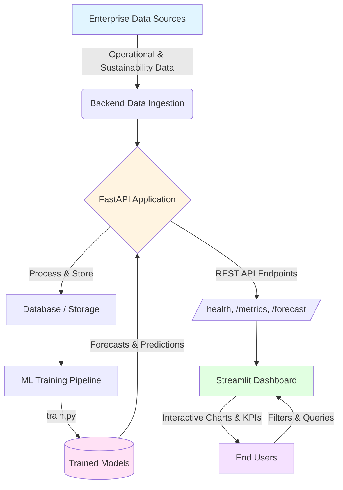

# EcoTrack-Enterprise

EcoTrack-Enterprise is an end-to-end sustainability analytics platform that combines a FastAPI backend with a Streamlit dashboard to deliver **enterprise-grade** carbon tracking, forecasting, and reporting.

## Problem

Organizations generate large volumes of operational data but struggle to translate it into accurate, real-time insights about their carbon emissions and sustainability performance. Existing tools are often fragmented, hard to integrate, and lack ML-driven forecasting that can support strategic planning and compliance-ready reporting.

## Solution

EcoTrack-Enterprise unifies data ingestion, processing, and visualization into a single platform, making it easier to monitor, analyze, and forecast carbon metrics across an enterprise. A FastAPI backend exposes clean APIs and ML-powered endpoints, while a Streamlit dashboard provides interactive views, alerts, and executive summaries tailored for decision-makers.

## Features

- FastAPI backend for carbon metrics, forecasting, and data APIs.
- Streamlit frontend for interactive dashboards and executive-ready reports.
- Pluggable ML models with a dedicated training pipeline for prediction and anomaly detection.
- Environment-aware configuration for local development and Docker-based deployment.
- Health-check endpoint for uptime monitoring and integration testing.

## Tech Stack

- **Backend:** Python, FastAPI, Uvicorn, ML libraries (see `backend/requirements.txt`).
- **Frontend:** Python, Streamlit (see `frontend/requirements.txt`).
- **Containerization:** Docker, Docker Compose.
- **Environment:** Virtual environment recommended for local development.

## Project Structure

```text
Eco-Enterprise/
├─ backend/
│  ├─ app/
│  │  ├─ main.py        # FastAPI entrypoint
│  │  └─ ml/
│  │     └─ train.py    # Model training pipeline
│  └─ requirements.txt  # Backend dependencies
├─ frontend/
│  ├─ dashboard.py      # Streamlit UI entrypoint
│  └─ requirements.txt  # Frontend dependencies
├─ docker-compose.yml   # Orchestrates backend + frontend
├─ run_command.txt      # Quick start and run instructions
└─ .gitignore
```

## How it works (DFD / Flow)

High-level flow from user and data to insights:

1. **Data Sources**  
   - Operational and sustainability data are collected from enterprise systems, files, or APIs and loaded into the backend processing layer.

2. **Backend Processing (FastAPI + ML)**  
   - The FastAPI app (`backend/app/main.py`) exposes REST endpoints for ingesting and retrieving sustainability metrics.
   - The ML pipeline (`backend/app/ml/train.py`) trains models that compute forecasts, risk scores, or anomaly flags used by the APIs.

3. **API Layer**  
   - The backend serves JSON responses with metrics, trends, and model predictions that the frontend can consume.
   - A health endpoint (for example `/health`) allows monitoring tools to verify that the service is available.

4. **Frontend Dashboard (Streamlit)**  
   - The Streamlit app (`frontend/dashboard.py`) calls the backend APIs, renders charts/tables, and provides filters for exploring metrics by time, business unit, or scenario.
   - Users interact via the browser to explore live KPIs, forecasts, and reports.

5. **Users & Stakeholders**  
   - Sustainability teams, operations engineers, and leadership use the dashboard to make data-driven decisions and track progress toward sustainability goals.

### System Architecture & Data Flow

The following Mermaid diagram illustrates how data flows through the EcoTrack-Enterprise system:



## Quick Start (Local)

Follow these steps to run the setup on your machine.

### 1. Clone the repository

```bash
git clone https://github.com/poojakira/Eco-Enterprise.git
cd Eco-Enterprise
```

### 2. Create and activate a virtual environment

```powershell
python -m venv venv
.\venv\Scripts\activate
```

### 3. Install dependencies

```powershell
pip install -r backend/requirements.txt
pip install -r frontend/requirements.txt
```

### 4. Train the ML model

```powershell
$env:PYTHONPATH="backend"; python backend/app/ml/train.py
```

### 5. Run backend and frontend

**Terminal A – Backend**

```powershell
cd backend
uvicorn app.main:app --port 8000 --host 127.0.0.1 --reload
```

**Terminal B – Frontend**

```powershell
cd frontend
streamlit run dashboard.py --server.port 8501 --server.address 127.0.0.1
```

### 6. Access the application

- Dashboard: `http://127.0.0.1:8501`  
- API health: `http://127.0.0.1:8000/health`  

## Docker Deployment

```bash
docker-compose up --build
```

Then open:

- Dashboard: `http://127.0.0.1:8501`  
- API health: `http://127.0.0.1:8000/health`  

## Environment Variables

Examples (adapt as needed):

```text
APP_ENV=development
API_HOST=127.0.0.1
API_PORT=8000
STREAMLIT_PORT=8501
```
