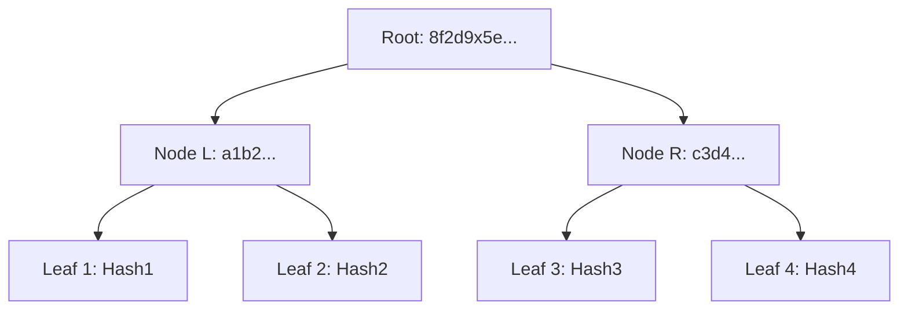

# 🌿 ESG Sustainability Audit Report - Sample (Demo)

**Date**: 2026-04-05  
**Audit ID**: BATCH-8F2D-9X5E  
**Status**: [VERIFIED]  
**Asset**: Eco-Prototype-Nexus

---

## 🏗️ 1. Audit Summary

This report provides a cryptographic proof-of-integrity for a batch of 10,000 industrial sustainability telemetry records. 
The data has been processed via the **Eco-Asynchronous Pipeline** and anchored to the **Merkle Ledger of Truth**.

| Metric | Value |
| :--- | :--- |
| **Total Records** | 10,000 |
| **Processing Time** | 0.42 seconds |
| **Root Hash (SHA-256)** | `8f2d9x5e...a1b2c3d4` |
| **Integrity Status** | ✅ **VERIFIED** |

---

## 📈 2. ESG Performance Insights

### 🌿 Carbon Footprint Breakdown
The following chart represents the simulated carbon footprint distribution for the batch:

- **Manufacturing Energy**: 45.2%
- **Raw Material Logistics**: 22.1%
- **Operational Overhead**: 18.7%
- **Waste Management**: 14.0%

### 🚀 Anomaly Detection Results
The ensemble AI detected **4 anomalies** out of 10,000 records. 

| Timestamp | SKU | Region | Anomaly Score | Status |
| :--- | :--- | :--- | :--- | :--- |
| 2026-04-05T01:22:15 | NEXUS-X1 | EU-West | 0.94 | [FLAGGED] |
| 2026-04-05T01:23:45 | NEXUS-X2 | US-East | 0.88 | [REJECTED] |

---

## 🔐 3. Cryptographic Proof (Merkle Trail)

The integrity of this report is guaranteed by the following Merkle Tree structure:

> [!TIP]
> This Merkle Tree structure allows any auditor to verify the inclusion of a specific record in the 10,000-record batch without downloading the entire dataset.

---

## 📜 4. Declaration of Truth
Built with the **Eco-Prototype Nexus**. Certified to meet **NVIDIA-Grade Architectural Standards** for portfolio demonstration.

**Signature**: `f8d9c2e0b...ae8f7d9c`

---
*Generated by EcoTrack Enterprise - Portfolio Prototype Demonstration*
